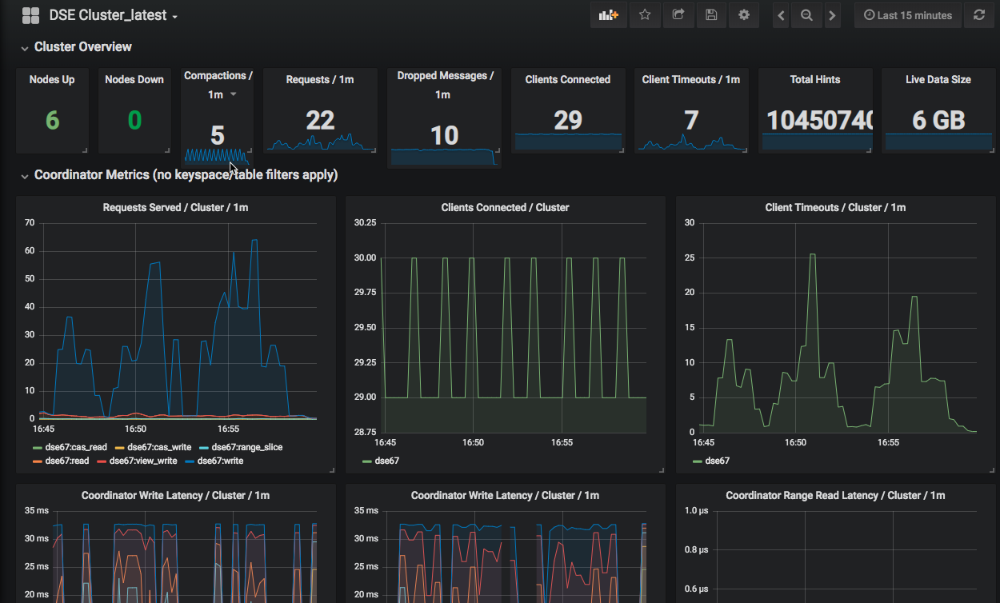

# DSE Metrics Collector Dashboards

This repository contains preconfigured Grafana dashboards that integrate with DSE Metrics Collector. Use DSE Metrics Collector to export DSE metrics to a monitoring tool like Prometheus, and then visualize DSE metrics in the Grafana dashboards.

Use Docker and modify the provided Prometheus configuration file, or manually export DSE metrics to an existing Prometheus server. Although the examples in the linked documentation use Prometheus as the monitoring tool, you can export the aggregated metrics to other tools like Graphite and Splunk.

## WARNING

By default, Prometheus is configured to retain 15 days' worth of data only. **To avoid unexpected loss of data metrics, adjust the default rentention period**. To keep a history of your metrics data beyond the default setting, you must add the `--storage.tsdb.retention=` flag to the `docker-compose.yml` file at the Prometheus runtime command line.

## Getting started

Clone this repository and then follow the instructions in the DataStax documentation based on your implementation:

* [Export and visualize metrics with Prometheus and Docker](https://docs.datastax.com/en/dse/6.7/dse-admin/datastax_enterprise/tools/metricsCollector/mcExportMetricsDocker.html);
* [Manually export and visualize metrics with Prometheus](https://docs.datastax.com/en/dse/6.7/dse-admin/datastax_enterprise/tools/metricsCollector/mcExportMetricsManually.html).

### Generation of the tg_dse.json file

In some cases, such as using a big cluster, the `tg_dse.json` file could be generated by one of the auxiliary scripts located in the `extras` directory. These scripts are examples, and do not handle every configuration, such as authentication:

* `generate-discovery-file.sh`: this script uses the `nodetool` command to extract a list of servers in the cluster, and generate a service discovery file. Run this script on a single nodes in the cluster. The script accepts the following parameters: 
  * Name of file to which the data will be written (Required)
  * Port number (Optional, defaults to 9103)
* `generate-discovery-file.py`: this script uses the [DSE Python driver](https://docs.datastax.com/en/developer/python-dse-driver/latest/) to fetch cluster metadata, and generate a service discovery file. The script accepts the following parameters:
  * Contact point that is used to connect to cluster (Required)
  * Name of file to which the data will be written (Required)
  * Port number (Optional, defaults to 9103)

These scripts can also be used for periodic refresh of the `tg_dse.json` file to reflect changes in the cluster's topology.

## Support

The code, examples, and snippets provided in this repository are not "Supported Software" under any DataStax subscriptions or other agreements.

Slack - https://academy.datastax.com/slack #dse-metric-collector

## License

Please refer to [LICENSE](LICENSE.md) file.

## Examples

The following screenshots illustrate the preconfigured dashboards in this repository.

#### DSE Cluster Condensed

#### DSE System & Node Metrics

#### DSE Cluster Latest

#### Prometheus Statistics

